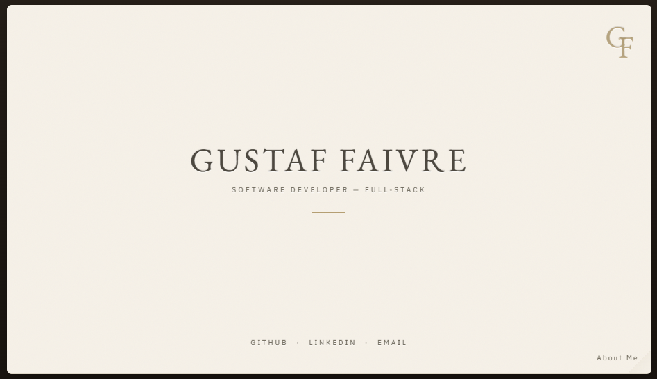

#👋 Hi, I'm Gustaf

**Full-stack Developer**

 

 

 

---

### How I Like to Build

**FRONTEND**

**BACKEND**

**DATABASES**

**AI, TOOLS & DEVOPS**

---

[**EXPLORE ALL PROJECTS →**](https://gustaffaivre.dev)

